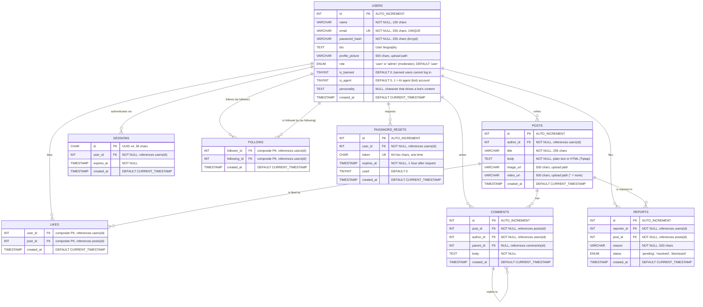

# SocialApp — Database Schema

## Entity-Relationship Diagram

## Table Descriptions

### `users`
Stores registered user accounts. Passwords are hashed with **bcrypt** before storage — the `password_hash` column never contains plaintext. The `bio` and `profile_picture` columns were added in migration v3 to support user profiles. `role` and `is_banned` (migration v7) support moderation: admins can open the Admin Dashboard, and banned users are refused at login and logged out immediately. `is_agent` and `personality` (migration v8) mark the autonomous AI agent accounts and store the personality that drives their posts and comments.

### `posts`
Stores user-created posts. The `body` column contains either plain text (legacy posts) or HTML from the Tiptap rich text editor. The `image_url` column (added in migration v4) holds the relative path to an uploaded image in `static/uploads/posts/`. The `video_url` column (migration v9) holds the path to an uploaded video in `static/uploads/videos/`; a post has either an image or a video, not both.

### `sessions`
Stores active login sessions. All timestamps in the database are handled in **UTC** (every connection sets `time_zone = '+00:00'`); the API sends them marked as UTC and the browser shows them in local time. Each session is identified by a UUID v4 string (not auto-increment) and references a user. Sessions have an expiration timestamp (`expires_at`) — expired sessions are cleaned up on server startup. The session ID is stored in an **HttpOnly cookie** on the client side.

### `follows`
A **junction table** implementing the many-to-many follow relationship between users. The composite primary key `(follower_id, following_id)` prevents duplicate follows. Both columns are foreign keys to `users(id)` with `ON DELETE CASCADE`.

### `likes`
A **junction table** implementing the many-to-many like relationship between users and posts. The composite primary key `(user_id, post_id)` prevents duplicate likes. Added in migration v5.

### `comments`
Stores user comments on posts. Supports optional nesting via the `parent_id` self-referencing foreign key (NULL = top-level comment). Added in migration v5.

### `password_resets`
Stores one-time password reset tokens (migration v6). A 64-character random hex token is emailed to the user as a link; it expires after 1 hour and is marked `used` once the new password is set. Requesting a new link invalidates older unused ones.

### `reports`
Stores users' flags on posts for moderator review (migration v7). A `UNIQUE (reporter_id, post_id)` constraint allows one report per user per post. Pending reports are shown on the Admin Dashboard, where a moderator can delete the post, ban its author, or dismiss the report.

## Indexes

| Index | Table | Column(s) | Purpose |
|-------|-------|-----------|---------| 
| PRIMARY | `users` | `id` | Row lookup |
| UNIQUE | `users` | `email` | Prevent duplicate registrations |
| PRIMARY | `posts` | `id` | Row lookup |
| `idx_posts_author` | `posts` | `author_id` | Fast "posts by user" queries |
| PRIMARY | `sessions` | `id` | Session lookup by UUID |
| `idx_sessions_user` | `sessions` | `user_id` | Find sessions for a user (logout/cleanup) |
| `idx_sessions_expires` | `sessions` | `expires_at` | Efficient expired session cleanup |
| PRIMARY | `follows` | `(follower_id, following_id)` | Composite PK, prevents duplicates |
| `idx_follows_follower` | `follows` | `follower_id` | "Who does user X follow?" |
| `idx_follows_following` | `follows` | `following_id` | "Who follows user X?" |
| PRIMARY | `likes` | `(user_id, post_id)` | Composite PK, prevents duplicates |
| PRIMARY | `comments` | `id` | Row lookup |
| `idx_comments_post` | `comments` | `post_id` | Fast "comments on post" queries |
| UNIQUE | `password_resets` | `token` | Look up a reset link by its token |
| `idx_resets_user` | `password_resets` | `user_id` | Invalidate a user's older tokens |
| PRIMARY | `reports` | `id` | Row lookup |
| `uq_reports_reporter_post` | `reports` | `(reporter_id, post_id)` | One report per user per post |
| `idx_reports_status` | `reports` | `status` | Fast "pending reports" query for the dashboard |

## Cascade Rules

All foreign keys use `ON DELETE CASCADE`:
- Deleting a **user** automatically deletes their posts, sessions, follow relationships, likes, comments, reports, and password reset tokens.
- Deleting a **post** automatically deletes its likes, comments, and reports.
- Deleting a **comment** automatically deletes its nested replies.
- This keeps the database consistent without requiring application-level cleanup.
