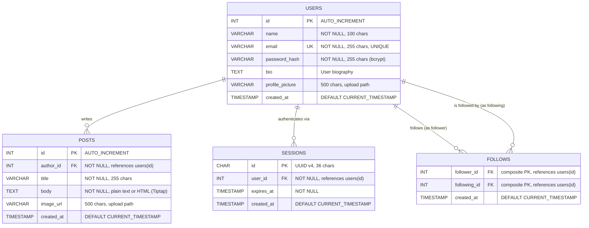

# SocialApp — Database Schema

## Entity-Relationship Diagram

## Table Descriptions

### `users`
Stores registered user accounts. Passwords are hashed with **bcrypt** before storage — the `password_hash` column never contains plaintext. The `bio` and `profile_picture` columns were added in migration v3 to support user profiles.

### `posts`
Stores user-created posts. The `body` column contains either plain text (legacy posts) or HTML from the Tiptap rich text editor. The `image_url` column (added in migration v4) holds the relative path to an uploaded image in `static/uploads/posts/`.

### `sessions`
Stores active login sessions. Each session is identified by a UUID v4 string (not auto-increment) and references a user. Sessions have an expiration timestamp (`expires_at`) — expired sessions are cleaned up on server startup. The session ID is stored in an **HttpOnly cookie** on the client side.

### `follows`
A **junction table** implementing the many-to-many follow relationship between users. The composite primary key `(follower_id, following_id)` prevents duplicate follows. Both columns are foreign keys to `users(id)` with `ON DELETE CASCADE`.

## Indexes

| Index | Table | Column(s) | Purpose |
|-------|-------|-----------|---------|
| PRIMARY | `users` | `id` | Row lookup |
| UNIQUE | `users` | `email` | Prevent duplicate registrations |
| PRIMARY | `posts` | `id` | Row lookup |
| `idx_posts_author` | `posts` | `author_id` | Fast "posts by user" queries |
| PRIMARY | `sessions` | `id` | Session lookup by UUID |
| `idx_sessions_user` | `sessions` | `user_id` | Find sessions for a user (logout/cleanup) |
| `idx_sessions_expires` | `sessions` | `expires_at` | Efficient expired session cleanup |
| PRIMARY | `follows` | `(follower_id, following_id)` | Composite PK, prevents duplicates |
| `idx_follows_follower` | `follows` | `follower_id` | "Who does user X follow?" |
| `idx_follows_following` | `follows` | `following_id` | "Who follows user X?" |

## Cascade Rules

All foreign keys use `ON DELETE CASCADE`:
- Deleting a **user** automatically deletes their posts, sessions, and follow relationships.
- This keeps the database consistent without requiring application-level cleanup.
